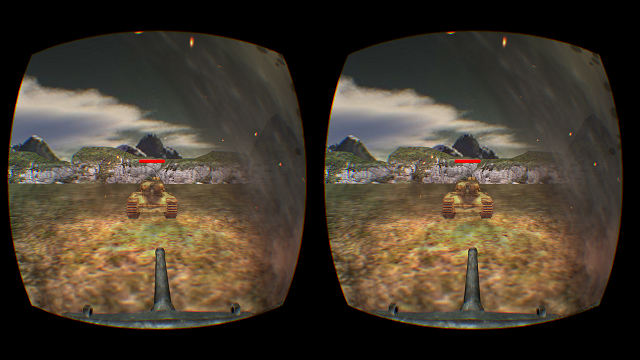

cocosVR
================

cocosVR is a demo for show how to run a cocos2d game on VR platform

cocosVR is a showcase project using cocos2d-x 3.10

The code of this project and Cocos2d-x are all licensed under MIT

You may not use any art including 2d and 3d from this project for commercial purpose



##Git user attention

1.Clone the repo from Github

```
$ git clone https://github.com/songchengjiang/cocosVR.git
```

2.Update the submodule of cocosVR

```
$ git submodule update --init
```

3.Update the submodule of cocos2d-x

```
$ cd cocos2d
$ git submodule update --init
```

4.After cloning the repo, please execute `download-deps.py` to download and install dependencies

```
$ cd cocos2d
$ python download-deps.py
```


##VR Platform support
This project supports Three VR platforms: **Oculus VR**(win32), **Gear VR** and **Deepoon VR**(Samsung Note4/5 S6).

###SDK Requires
OculusVR PC **SDK V0.8**.

OculusVR Mobile **SDK V1.0.0.1**.

Deepoon Mobile **SDK V0.1.2**.

###environment variables
**OVRSDKROOT:**  PATH/

**OVRSDKMOBILEROOT:** PATH/

**DEEPOONSDKROOT:** PATH/samples/samples/native/SDKLib/

> PATH means the absolute path of SDK root directory

###win32 runtime
Path: `cocosVR/proj.win32/cocosVR.sln`.
>Requires Visual Studio 2015 and above.

###android runtime
Path: `cocosVR/proj.android/`.

execute `build_native.py -V gearvr` for **Gear VR platforms**

execute `build_native.py -V deepoon` for **Deepoon VR platforms**

##Credits
* Game Effects: Jiang SongCheng
* Game Logic: Jiang SongCheng
* Game Sound: Jiang SongCheng
* VR technical support: Jiang SongCheng, Xu HuaBing, etc